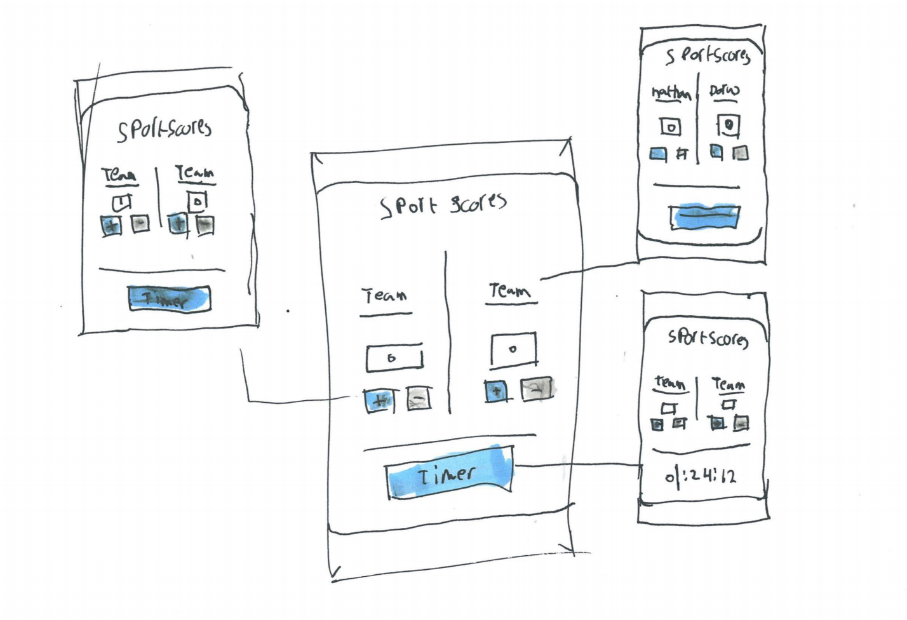

# Browser-tech 18/19

## Sport scores

For this project i've made an app to keep track of scores during a soccer match


<!-- Add a link to your live demo in GitHub Pages 🌐-->
## Code
[live demo](https://dorusth.github.io/browser-technologies-1819/Opdracht%202/)|[Repo](https://github.com/dorusth/browser-technologies-1819)

<!-- ☝️ replace this description with a description of your own work -->

<!-- Add a nice image here at the end of the week, showing off your shiny frontend 📸 -->


<!-- Maybe a table of contents here? 📚 -->
## table of contents
- [Installation](#Installation)


<!-- How about a section that describes how to install this project? 🤓 -->
## Installation
this project doesn't have any dependencties so you can clone and run it with:
```bash
$ git clone https://github.com/dorusth/browser-technologies-1819.git
```
and/or download the files and open the index.html file


<!-- ...but how does one use this project? What are its features 🤔 -->
## Wireflows
### Functional layer

The core functionality of this site is to keep track of the scores of a match you're playing.
In the basic version the user gets forms/input fields to fill in the score and team names
### Pleasurable layer

with the pleasurable layer the user gets a nicer looking interface with:
- Easier to use buttons
- A timer to keep track of how long the match is
- LocalStorage to keep the progress when the page is reloaded
- Offline functionality

## Features
- Keeping track of scores in plain html forms


- When javascript is active extra interactive elements are loaded for Easier adjustment of the score and a timer is added to the page to keep track of the timer
- when local storage is enabled the team names and scores are saved to the local storage and reverenced on the next visit
- A serviceWorker caches the files for faster loads and offline support

## Feature detects
- Javascript
	- **localstorage**: Javascript first checks if localstorage exists before adding the match to the localStorage
	- **eventListeners**:avascript first checks if eventlisteners are supported before adding the buttons that depend on eventListeners
	- **serviceWorker**: javascript checks if the browser supports serviceWorkers before adding one to the browser
- Styling
	- **flexbox**: To add support for IE10 an extra css element is added with ```display: -ms-flexbox; ``` due to the different syntax in IE10

## Accessibility

### No images
- Fallback background image

### Custom fonts
- the site uses system fonts

### No Javascript
- The features that use javascript for interaction are only rendered in when javascript works

### Color
- colors have high contrast and have text/icons as fallback

### Slow network
- files are cached on first visit to decrease load time/requests on the next visits

### Cookies
- The site doesnt use Cookies

### Local Storage
- The site uses local storage as an enhancement and the site works without LocalStorage


### No mouse/Trackpad
- All the interactive elements have proper naming(input,button etc....) so it is accessible by keyboard and screen readers

## accessibility

[MIT](LICENCE) © [Dorus ten Haaf](https://dorustenhaaf.com)
